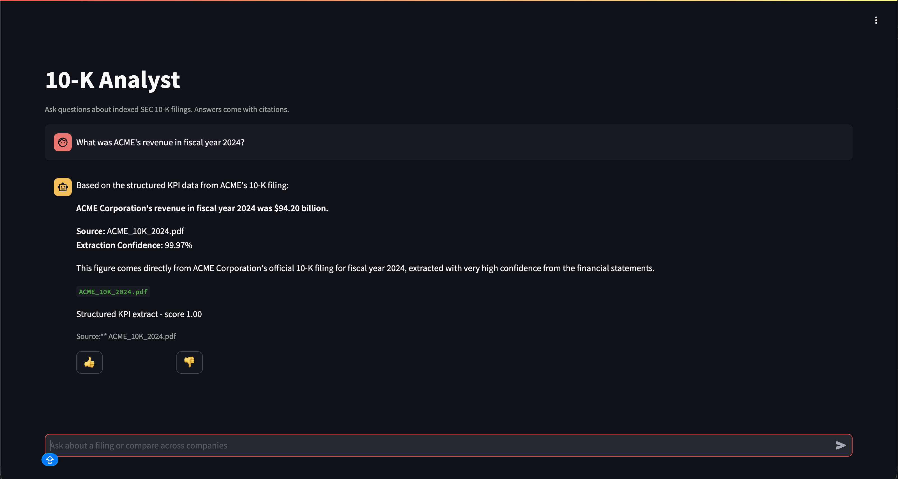

# Databricks Document Intelligence Agent

[](./LICENSE)
[](https://www.python.org/downloads/)
[](https://docs.databricks.com/aws/en/dev-tools/cli/install)
[](./PRODUCTION_READINESS.md)

A Databricks-native reference implementation for document intelligence agents. It parses PDFs with Databricks AI Functions, extracts structured KPIs into governed Delta tables, indexes high-quality document summaries with Mosaic AI Vector Search, and serves cited answers through Agent Bricks and Databricks Apps.

The demo corpus is synthetic SEC 10-K filings, but the pattern applies to other enterprise document sets such as contracts, invoices, research reports, and regulatory filings.

```
PDFs in UC volume
      |
      v
Lakeflow pipeline: parse -> classify/extract -> quality score
      |
      +--> Gold KPI tables
      |
      +--> Vector Search index
               |
               v
Agent Bricks Knowledge Assistant + Supervisor Agent
               |
               v
Databricks App with citations, feedback, and Lakebase history
```

## Where To Read

| Need | Doc |
|---|---|
| Architecture and Agent Bricks design | [`docs/design.md`](./docs/design.md) |
| Setup, deploy, operations, troubleshooting | [`docs/runbook.md`](./docs/runbook.md) |
| Validation commands and latest workspace evidence | [`VALIDATION.md`](./VALIDATION.md) |
| Production readiness gates | [`PRODUCTION_READINESS.md`](./PRODUCTION_READINESS.md) |
| Identity, OBO, grants, and secrets | [`SECURITY.md`](./SECURITY.md) |
| Streamlit app local development | [`app/README.md`](./app/README.md) |

## What This Builds

- Lakeflow Spark Declarative Pipeline over raw PDF filings.
- Gold tables for parsed sections, structured KPIs, and quality scoring.
- Mosaic AI Vector Search Delta-Sync index over high-quality section summaries.
- Agent Bricks Knowledge Assistant grounded in the Vector Search index.
- Agent Bricks Supervisor Agent with Knowledge Assistant and UC SQL KPI tools.
- Streamlit Databricks App with citation chips, thumbs feedback, and Lakebase Postgres persistence.
- MLflow CLEARS eval gate for correctness, latency, execution, adherence, relevance, and safety.

The Agent Bricks code artifact is [`agent/document_intelligence_agent.py`](./agent/document_intelligence_agent.py). It creates or updates the Knowledge Assistant, UC SQL function, Supervisor Agent, and serving-endpoint permissions.

## Prerequisites

- Python 3.11 or 3.12.
- Databricks CLI >= 0.298.
- A Databricks workspace with Serverless SQL, Unity Catalog, Document Intelligence AI Functions, Mosaic AI Vector Search, Agent Bricks, Databricks Apps, Lakebase, and Lakehouse Monitoring enabled.
- A serverless SQL warehouse ID.

For production identity, Databricks Apps user token passthrough must be enabled. Demo can run with App service-principal fallback; prod must use OBO. See [`SECURITY.md`](./SECURITY.md).

## Quickstart

Install local dependencies:

```bash
python -m venv .venv
.venv/bin/pip install -r agent/requirements.txt -r evals/requirements.txt pytest
```

Find a serverless warehouse:

```bash
databricks warehouses list
```

Validate the bundle:

```bash
databricks bundle validate --strict -t demo
```

Bring up a demo workspace:

```bash
DOCINTEL_CATALOG=workspace \
DOCINTEL_SCHEMA=docintel_10k_demo \
DOCINTEL_WAREHOUSE_ID=<warehouse-id> \
./scripts/bootstrap-demo.sh
```

Run the eval gate:

```bash
DOCINTEL_CATALOG=workspace DOCINTEL_SCHEMA=docintel_10k_demo \
.venv/bin/python evals/clears_eval.py \
  --endpoint "$(./scripts/resolve-agent-endpoint.sh demo)" \
  --dataset evals/dataset.jsonl
```

Open **Apps -> `doc-intel-analyst-demo`** in the Databricks workspace and ask:

> What was ACME's revenue in fiscal year 2024?

Example deployed Databricks App validation:



## Common Commands

```bash
# Unit tests
.venv/bin/python -m pytest agent/tests/ -q

# Static checks
bash -n scripts/bootstrap-demo.sh
.venv/bin/python -m py_compile \
  agent/document_intelligence_agent.py agent/tools.py \
  app/app.py app/agent_bricks_client.py app/agent_bricks_response.py app/lakebase_client.py \
  evals/clears_eval.py scripts/wait_for_kpis.py samples/synthesize.py

# Deploy app/config changes after first bring-up
AGENT_ENDPOINT_NAME="$(./scripts/resolve-agent-endpoint.sh demo)"
databricks bundle deploy -t demo --var "agent_endpoint_name=${AGENT_ENDPOINT_NAME}"
databricks bundle run -t demo --var "agent_endpoint_name=${AGENT_ENDPOINT_NAME}" analyst_app

# Apply Agent Bricks definition changes
DOCINTEL_CATALOG=workspace \
DOCINTEL_SCHEMA=docintel_10k_demo \
DOCINTEL_WAREHOUSE_ID=<warehouse-id> \
python -m agent.document_intelligence_agent --target demo
```

More deploy paths and failure handling live in [`docs/runbook.md`](./docs/runbook.md).

## Repo Layout

```
databricks/
├── databricks.yml                 # Bundle root: variables and demo/prod targets
├── pipelines/sql/                 # Bronze, Silver, Gold Lakeflow SQL
├── agent/                         # Agent Bricks definition and tool glue
├── app/                           # Streamlit Databricks App and Lakebase client
├── evals/                         # CLEARS dataset and MLflow eval runner
├── jobs/                          # Retention and Vector Search index refresh jobs
├── resources/foundation/          # DAB resources without data dependencies
├── resources/consumers/           # App, jobs, monitors, dashboards
├── scripts/                       # Bootstrap and workspace helper scripts
├── samples/                       # Regenerable synthetic 10-K PDFs
├── specs/001-doc-intel-10k/       # Spec-Kit artifacts
└── docs/                          # Design and runbook
```

## Current Status

Latest demo evidence is tracked in [`VALIDATION.md`](./VALIDATION.md#latest-demo-snapshot). Readiness gates are tracked in [`PRODUCTION_READINESS.md`](./PRODUCTION_READINESS.md).

## License

Released under the [MIT License](./LICENSE).
